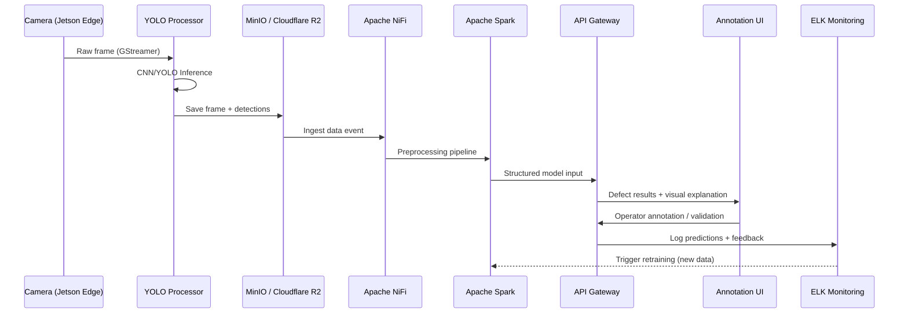
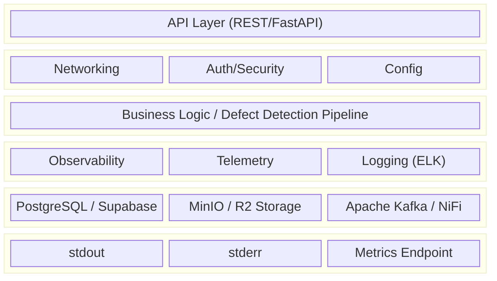
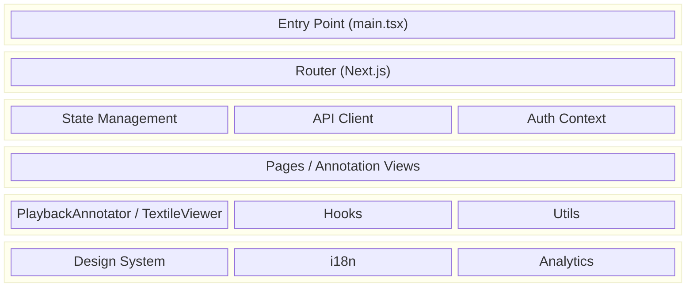

# AIRise — AIFR-AI: AI-Powered Fabric Defect Detection

> Real-time AI fabric inspection system for Katty Fashion — CNN-based defect detection on edge devices (Jetson), integrated with existing MinIO/NiFi/Spark infrastructure, funded via AIRISE Open Call 1 (EU Horizon Europe).

## Quick Links

- [KF Dashboard](https://katty-fashion.github.io/kf-cpto/) — Unified project view
- [Project Page](https://katty-fashion.github.io/kf-cpto/projects/airise/) — Auto-generated from kanban
- [Unified Kanban](https://katty-fashion.github.io/kf-cpto/unified-kanban.html) — All tasks across KF Team

---

## Project Context

**AIFR-AI** is an EU-funded experiment under the **AIRISE Open Call 1** (Horizon Europe programme). Katty Fashion is deploying an AI-powered fabric quality inspection system starting from TRL 5, with the goal of automating defect detection on production fabric rolls using computer vision and deep learning.

The system integrates with the existing KF infrastructure (MinIO on-premise, Cloudflare R2, Apache NiFi, Apache Spark) and deploys YOLO/CNN-based models on NVIDIA Jetson edge devices for real-time inspection.

**Defect Categories:** Damage, Hole, Knot, Line, Oil Stain, Stain, Wrinkle, Miss Weaves, Wrong Prints

**AIRISE Service Partner:** DFKI (Design and Engineering AI Services, M3–M8)

**Total Budget:** 85.714 € | **EU Funding:** 59.999,6 €

---

## Architecture

### High-Level Design (HLD) — Sequence Flow



### Backend Service Anatomy

Every backend service/container follows this standard architecture:



**Layer Responsibilities:**

| Layer | Components | Purpose |
| :--- | :--- | :--- |
| **API Layer** | FastAPI REST endpoints, playback API | External interface for UI and integrations |
| **Infrastructure** | Network config, TLS, CORS, Auth middleware | Cross-cutting concerns |
| **Business Logic** | YOLO multiprocess detector, defect pipeline | Core CNN/YOLO inference |
| **Observability** | ELK Stack, Prometheus, structured logs | Model monitoring & debugging |
| **I/O** | MinIO, Cloudflare R2, PostgreSQL/Supabase | Data persistence & storage |
| **Output** | stdout (logs), stderr (errors), /metrics | Container output streams |

**Minimum Requirements for Production:**

```yaml
# Every service must have:
observability:
  - health_check: /health
  - readiness: /ready
  - metrics: /metrics (Prometheus format)
  - tracing: OpenTelemetry spans

logging:
  - format: JSON structured
  - output: stdout (info), stderr (errors)
  - elk_stack: model prediction logs + feedback

config:
  - env_vars: 12-factor app
  - secrets: mounted from vault/k8s secrets
  - feature_flags: runtime toggles
```

### Frontend (Annotation UI) Anatomy



**Frontend Layer Responsibilities:**

| Layer | Components | Purpose |
| :--- | :--- | :--- |
| **Entry** | main.tsx, App.tsx | Bootstrap application |
| **Routing** | Next.js layouts | Navigation & URL mapping |
| **State** | React Query, Context | Defect data management |
| **Pages** | Annotation views, playback UI | Screen-level components |
| **Components** | PlaybackAnnotator.tsx, TextileViewer.tsx | Defect review building blocks |
| **Infrastructure** | Theme, translations, tracking | Cross-cutting concerns |

---

## Architecture Options

### Plan A: Real-Time Streaming (WebRTC)
**Best for:** Ultra-low latency (<200ms), interactive annotation

**Components:**
- `secure_jetson_streamer.py` — Jetson WebRTC sender with YOLO
- `platform_server.py` — WebSocket signaling server
- `TextileViewer.tsx` — Next.js live viewer

**Pros:** Lowest latency, direct peer-to-peer  
**Cons:** Complex setup, NAT/firewall issues, connection instability

---

### Plan B: Async Playback ⭐ Recommended
**Best for:** Systematic annotation, unreliable networks, multiple reviewers

**Components:**
- `async_jetson_processor.py` — Async processor with local buffering
- `playback_api.py` — FastAPI backend
- `PlaybackAnnotator.tsx` — Next.js playback UI

**Pros:** Works offline, scalable, complete audit trail, simpler than WebRTC  
**Cons:** Not real-time (batch processing)

---

### Plan C: RTSP Streaming (Simplest)
**Best for:** Reliable streaming, many viewers, firewall/proxy environments

**Components:**
- `rtsp_jetson_streamer.py` — RTSP sender with YOLO
- MediaMTX — Media server
- Browser with HLS.js or MediaMTX WebRTC output

**Pros:** Simplest setup, most reliable, works through firewalls, one-to-many streaming  
**Cons:** Higher latency than WebRTC (200ms–3s), requires media server

---

## Implementation Plan

| # | Activity | Due Date | Notes |
| :--- | :--- | :--- | :--- |
| 1 | Dataset collection | 31.08.2025 | Continuous data sharing from production start |
| 2 | Model design and training | 28.11.2025 | CNN models, iterative training on KF data |
| 3 | Infrastructure setup and integration | 20.02.2026 | Integrate model into current infra + edge |
| 4 | Workforce training | 27.02.2026 | Operator training on annotation UI |

---

## Performance Targets (KPIs)

| KPI | Target | Measurable |
| :--- | :--- | :--- |
| Detection Accuracy (F1-score) | ≥ 70% on real production data | Yes |
| Inference Speed | ≤ 1000 ms per image | Yes |
| Inspection Time Reduction | ≥ 50% per production lot | Yes |
| False Positive Rate | < 5% | Yes |
| Fabric Waste Reduction | ≥ 20% | Yes |
| Human Annotation Time | Reduce by ≥ 50% | Yes |
| Model Retraining | Within 48h after new data | Yes |

---

## Storage Options

All architectures support S3-compatible storage:

| Option | Type | Cost/TB | Setup | Best For |
| :--- | :--- | :--- | :--- | :--- |
| **MinIO** | Self-hosted (on-premise) | ~$24/mo | Hard | Full control, primary active data |
| **Cloudflare R2** | Cloud archive | Low | Easy | Cost-effective archiving |
| **Backblaze B2** | Cloud | $6/mo | Easy | Cost-effective cloud |
| **AWS S3** | Cloud | $23/mo | Easy | Enterprise, integrations |
| **Supabase** | Cloud | $21/mo | Easy | PostgreSQL + storage combo |

---

## Installation

**Quick install (Jetson):**

```bash
# Dependencies
sudo apt install python3-pip python3-gi gstreamer1.0-tools
pip3 install onnxruntime-gpu opencv-python numpy minio

# Download YOLO model
wget https://github.com/ultralytics/assets/releases/download/v0.0.0/yolov8n.onnx

# Choose your plan:
# Plan B (Recommended): python3 async_jetson_processor.py
# Plan A: python3 secure_jetson_streamer.py
# Plan C: python3 rtsp_jetson_streamer.py
```

---

## Project Structure

```
airise/
├── kanban.md                          # Task tracking (synced to KF-CPTO)
├── README.md                          # This file
├── .github/
│   └── workflows/
│       └── notify-kf-cpto.yml         # Auto-sync to dashboard
├── docs/
│   ├── QUICK_START.md
│   ├── PLAN_COMPARISON.md
│   ├── PLAN_C_RTSP.md
│   ├── ARCHITECTURE_DIAGRAMS.md
│   ├── PRODUCTION_DEPLOYMENT.md
│   ├── HIGH_FPS_OPTIMIZATION.md
│   ├── CUSTOM_YOLO_TRAINING.md
│   ├── SYNTHETIC_DATA_GENERATION.md
│   ├── IOT_EDGE_AI_APPLICATIONS.md
│   ├── S3_STORAGE_OPTIONS.md
│   └── SUPABASE_SETUP.md
│
├── Core Detection:
│   └── yolo_multiprocess_detector.py  # 4x parallel YOLO
│
├── Plan A (WebRTC):
│   ├── secure_jetson_streamer.py
│   ├── platform_server.py
│   ├── TextileViewer.tsx
│   └── viewer.html
│
├── Plan B (Async):
│   ├── async_jetson_processor.py
│   ├── playback_api.py
│   ├── PlaybackAnnotator.tsx
│   └── schema.sql
│
├── Plan C (RTSP):
│   └── rtsp_jetson_streamer.py
│
└── initial_files/                     # Original dev files (archived)
    ├── sender.py
    ├── signaling.py
    └── README.md
```

---

## Kanban Management

This repository uses a `kanban.md` file for task tracking that integrates with the [KF-CPTO Dashboard](https://github.com/katty-fashion/kf-cpto).

### Updating Tasks

Edit `kanban.md` in the repository root:

```markdown
---
project: airise
sprint: S2
sprint_start: 2026-03-16
sprint_end: 2026-03-27
---

# Project Kanban

| Task | Assignee | Effort | Status |
| :--- | :--- | :--- | :--- |
| Implement feature X | @developer | 3d | In Progress |
| Code review for Y | @reviewer | 1d | Review |
| Deploy to staging | @devops | 2d | Todo |
```

### Task Status Values

| Status | Description |
| :--- | :--- |
| `Todo` | Not started |
| `In Progress` | Currently being worked on |
| `Review` | Awaiting code review or approval |
| `Done` | Completed |

---

## Risk Register

| Risk | Probability | Impact | Mitigation |
| :--- | :--- | :--- | :--- |
| Insufficient or low-quality data | Medium | High | Strict data collection protocols, semi-automated labeling, data augmentation |
| Model underperforms in real-world conditions | Medium | High | Diverse training samples, production-like testing, human-in-the-loop validation |
| Real-time latency issues | Low | High | Model quantization, containerized API Gateway, edge inference on Jetson |

---

## Contribution to EU Goals

| Benefit | Value |
| :--- | :--- |
| Job creation in AI-enhanced manufacturing | +1 new AI engineer role |
| Digital transformation of EU textile SMEs | Replicable blueprint for EU-based SMEs |
| EU Green Deal contribution | Lower emissions via reduced waste and energy usage |

---

## Development

### Prerequisites

```bash
# Required tools
- Python 3.11+
- Node.js 20+
- Docker & Docker Compose
- NVIDIA Jetson (Xavier NX or AGX Orin recommended)
- kubectl (for K8s deployments)
```

### Setup

```bash
git clone https://github.com/katty-fashion/airise.git
cd airise

# Install Python dependencies
pip3 install onnxruntime-gpu opencv-python numpy minio fastapi uvicorn

# Install Node.js dependencies (annotation UI)
cd ui && npm install
```

---

## KF-CPTO Integration

When you push changes to `kanban.md`, the KF-CPTO dashboard automatically updates via GitHub Actions.

```bash
# Manual trigger via GitHub CLI
gh workflow run notify-kf-cpto.yml
```

---

## Contributing

1. Create a feature branch: `git checkout -b feature/my-feature`
2. Update `kanban.md` with your task
3. Make your changes
4. Update task status in `kanban.md`
5. Commit and push
6. Create a Pull Request

---

## Team

| Role | Contact |
| :--- | :--- |
| Product Owner | ps.tech@katty-fashion.ro |
| Tech Lead | el.tech@katty-fashion.ro |
| Backend | razvan.boita@katty-fashion.ro |
| Frontend | alexandru.bejenari@katty-fashion.ro |
| AIRISE Tutor | Muhammad Ahmed Ullah Khan [DFKI] |
| AIRISE Controller | Luis Usatorre [TECNALIA] |

---

## License

MIT

---

*Part of [KF Team](https://github.com/katty-fashion) · Managed via [KF-CPTO](https://github.com/katty-fashion/kf-cpto) · Funded by EU Horizon Europe — AIRISE Open Call 1*
